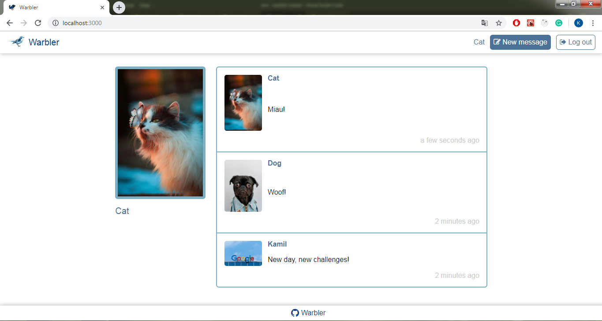
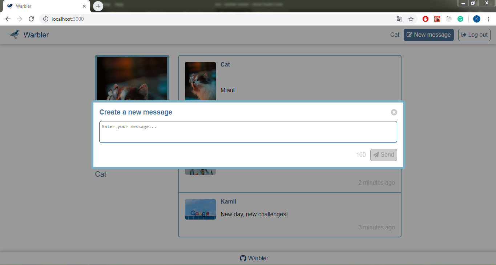
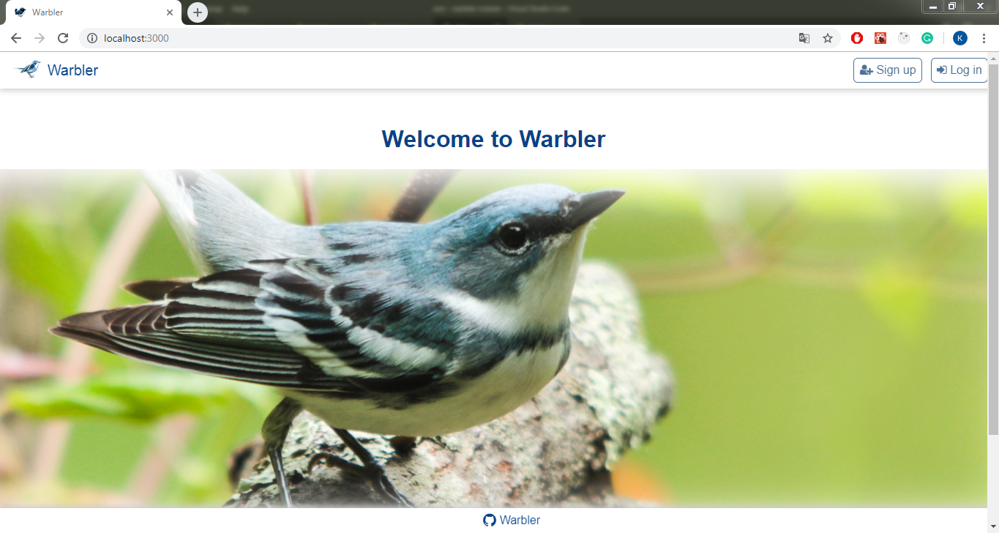
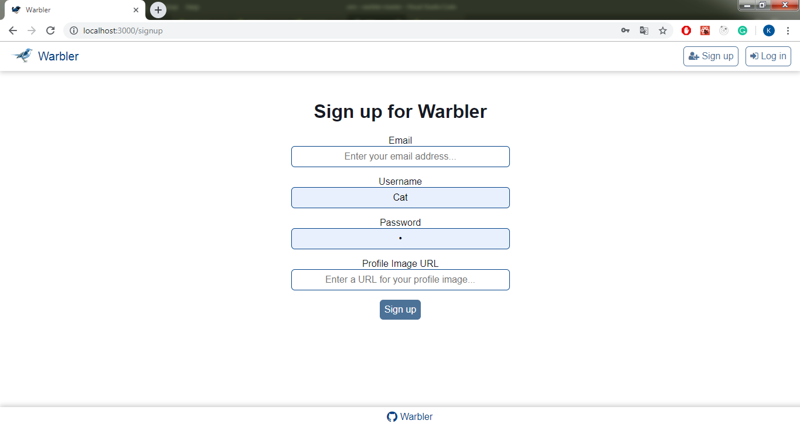

Projekt stworzony podczas kursu The Advanced Web Developer Bootcamp.
Aplikacja będąca klonem Twittera pozwala na udostępnianie krótkich wiadomości oraz oglądanie wiadomości innych.

link do kursu: https://www.udemy.com/course/the-advanced-web-developer-bootcamp/

Przy użyciu: React 16, React Router, Redux, Redux Thunk, JavaScript, NodeJS, Express, MongoDB, Mongoose.

------------------------------------------------------

This project was created along with The Advanced Web Developer Bootcamp course by Colt Steele.
Twitter-like app allowing posting short messages and looking over other users messages.

link to course: https://www.udemy.com/course/the-advanced-web-developer-bootcamp/

Technologies used: React 16, React Router, Redux, Redux Thunk, JavaScript, NodeJS, Express, MongoDB, Mongoose.

---------------------------------------------------

Screenshots

